# MementoBox

## Introduction

Welcome to MementoBox, a decentralized time-capsule platform built for the Ethereum ecosystem.  MementoBox represents a novel approach to private, delayed sharing of notes and media on the blockchain.

It leverages Ethereum's smart contracts to allow users to securely store messages and data, making them accessible only when certain conditions are met. This could be a predefined time period, a lack of proof of life, and other customizable triggers.

## Problem It Solves
In today's digital landscape, securely sharing private information with future access restrictions is difficult, especially when trust and security are paramount. Current solutions either rely on centralized services that are vulnerable to breaches or lack the necessary cryptographic rigor for secure, delayed sharing.
MementoBox addresses the need for a decentralized, trustless, and secure method to share sensitive information that will be unlocked only under specific conditions, such as for inheritance, contract disclosures, or scheduled events.

## Use Cases

Memento opens up a plethora of possibilities:

- **Inheritance Wills**: Securely store wills for future disclosure.
- **Education**: Teachers can schedule course materials for future release.
- **Business**: Schedule the release of vested stocks or confidential documents.
- **Event Promotion**: Create suspense and traction with timed reveals of secrets or announcements.

## How It Works

### Creating a Memento

1. **Upload and Lock**: Users upload their notes and documents, set a release date, and seal them with a cryptographic signature.
2. **Storage and Payment**: The sealed Memento is stored on IPFS, and users pay a transaction fee proportional to the lock duration.
3. **Sharing**: Users can share a Memento link and an unlock password with the intended recipient.

### Under the Hood

- **Encryption**: Data is encrypted before being broadcast on the blockchain.
- **Secret Sharing**: A secret key is shared with the recipient to decrypt the data at the right time.
- **Verifiable Delay Function (VDF)**: A puzzle that takes a predetermined time to solve is generated. The solution to this puzzle is the private key needed to unlock the Memento.

### Solvers

Memento relies on a network of Solvers who work on computing the time-lock puzzles. Solvers are incentivized through bounties proportional to the time spent solving these puzzles.

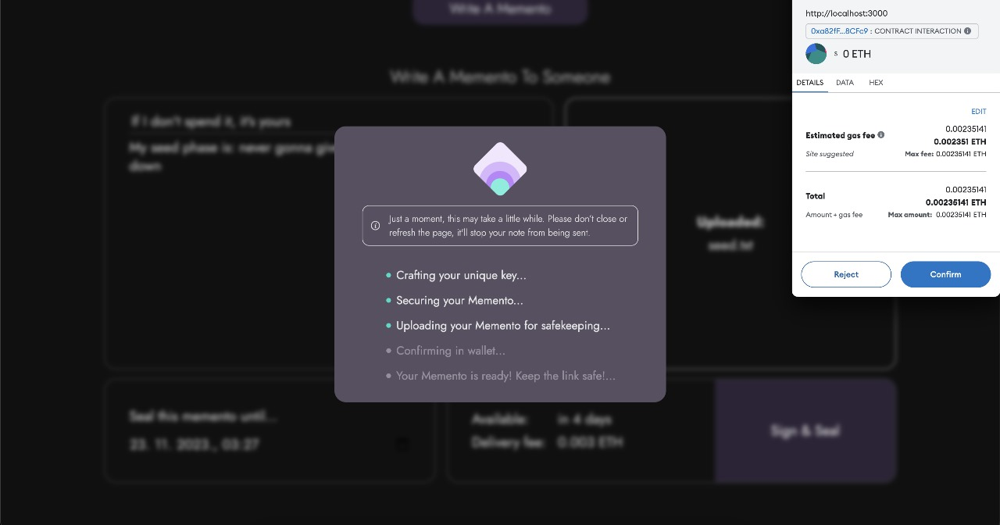
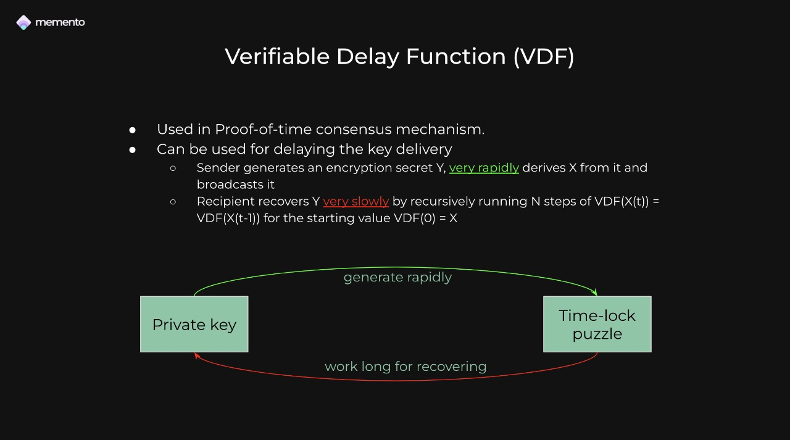
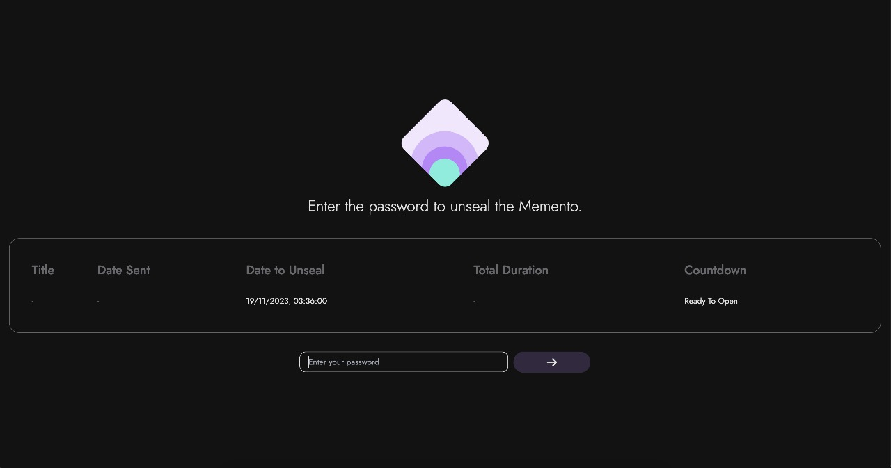

## Screenshots

### MementoBox Interface
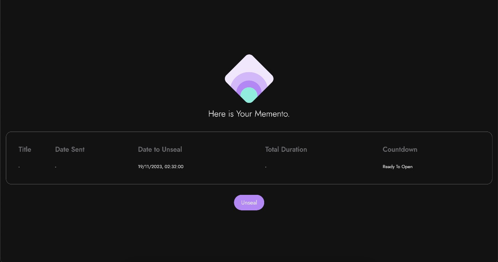

### Creating a Memento
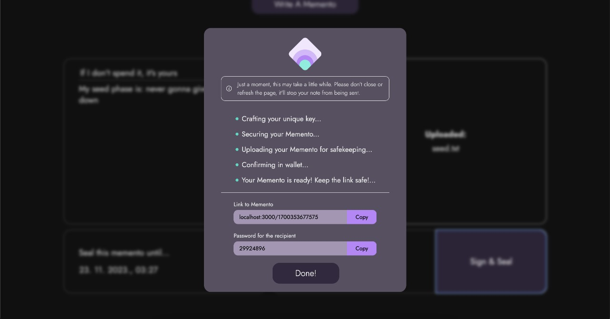
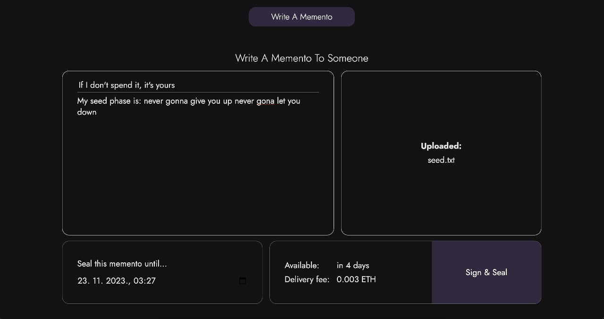
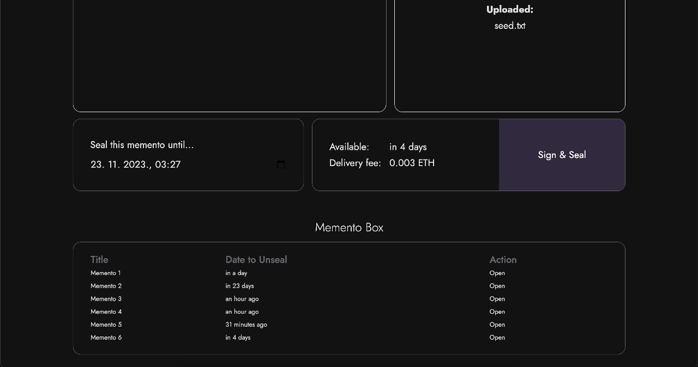
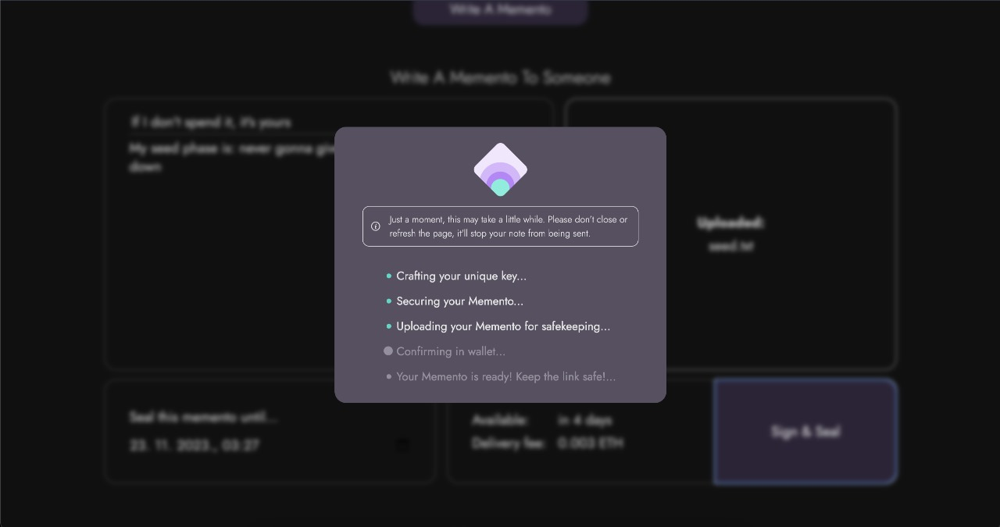

### Viewing a Memento
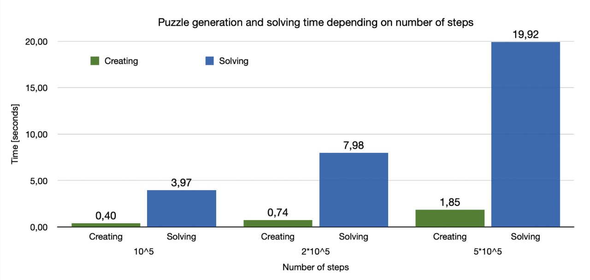
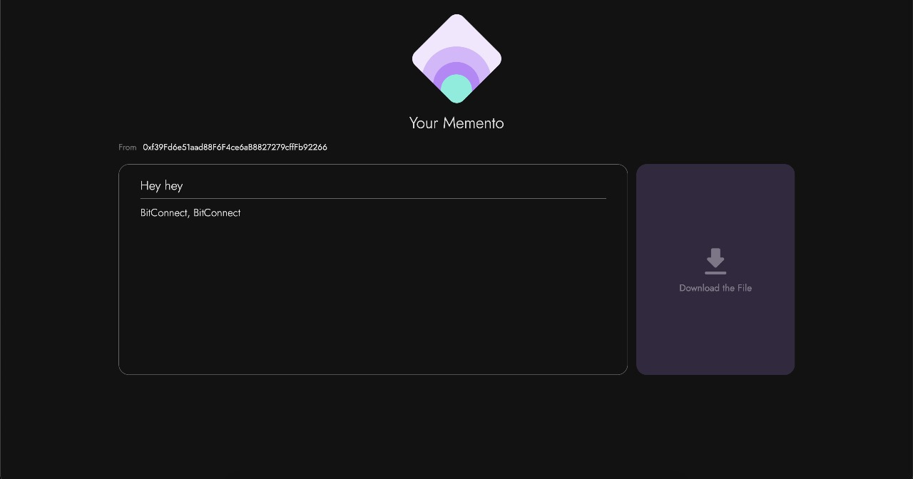

### Solver written in Rust

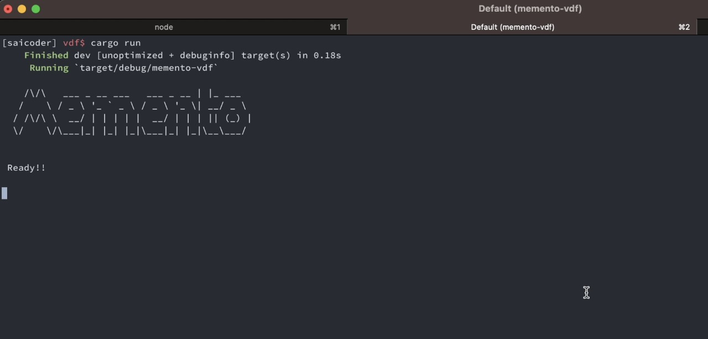
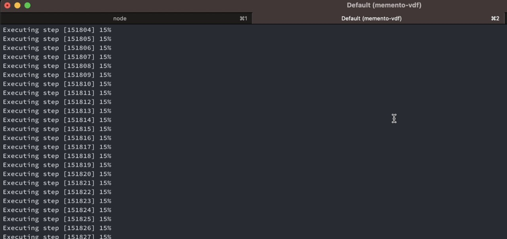

## Roadmap

- **Smart Contract**: Developed and deployed on Scroll EVM.
- **Frontend**: Deployed on BOS.
- **Time-Lock Protocol**: Fully implemented, excluding Solver rewards.
- **Ethereum Improvement Proposal (EIP)**: Submitted for community consideration.

# Deployments / Bounties

## Ethereum Sepolia contract address

0xaddBCDd962FbCa2Cb1bfeCe88a2d05cA42D21811

## Scroll contract address

0xc7f5c7f3819b107559567b556207b9fc0619e4a9

## Polygon Amoy contract address

0xB62DE565F1BA01Ee87f4095535877550c6CdC2Ea

## WalletConnect

Used Web3Modal.

## Filecoin

Used web3storage/nftstorage.

## Acknowledgements

Thank you for your interest in MementoBox! We hope our project inspires more privacy-preserving applications on the Ethereum blockchain.

---

